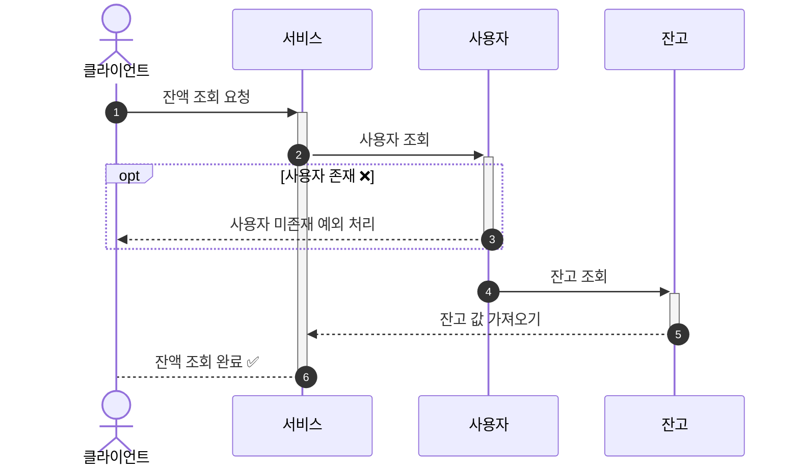
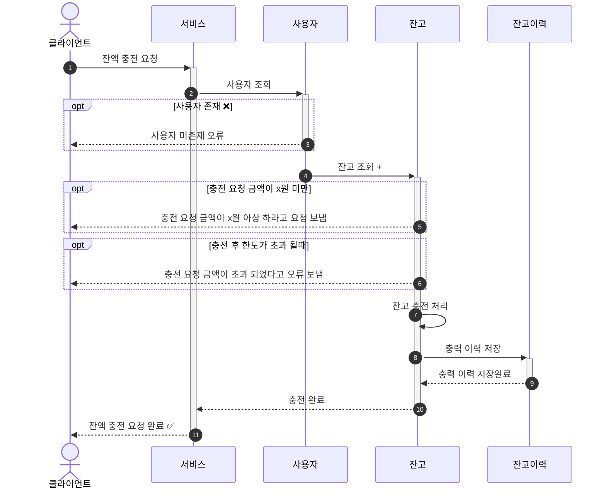
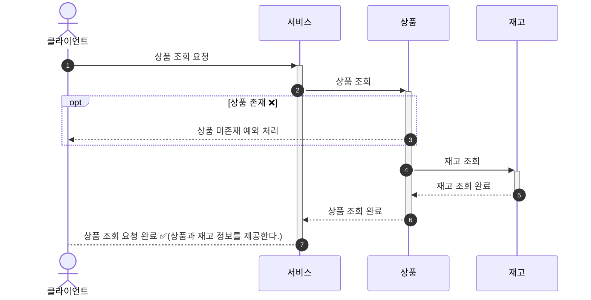
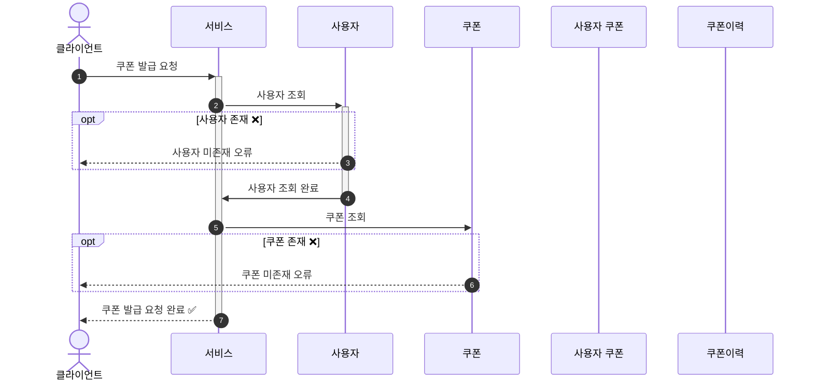

# 시퀀스 다이어그램

## 잔액
###  잔액 조회

1. 서비스에 요청한다.
2. 2~3 사용자 조회 하고 사용자 없으면 오류 보낸다.
3. 4~6 잔고를 조회해서 클라이언트한테 잔액을 제공한다.

###  잔액 충전

1. 서비스에 요청한다.
2. 2~3 사용자 조회 하고 사용자 없으면 오류 보낸다.
3. 4~7 잔고를 조회사 이상 없으면 충전 한다.
4. 8~9: 충전 아력을 저장한다.

## 상품
### 상품 조회

1. 서비스에 요청한다.
2. 2~3 상품 조회 하고 사용자 없으면 오류 보낸다.
3. 4~5 재고 조회 한다.

## 쿠폰
### 쿠폰 발급
