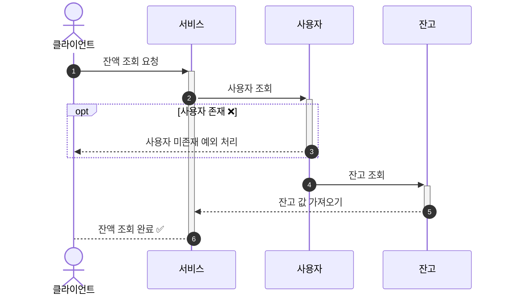
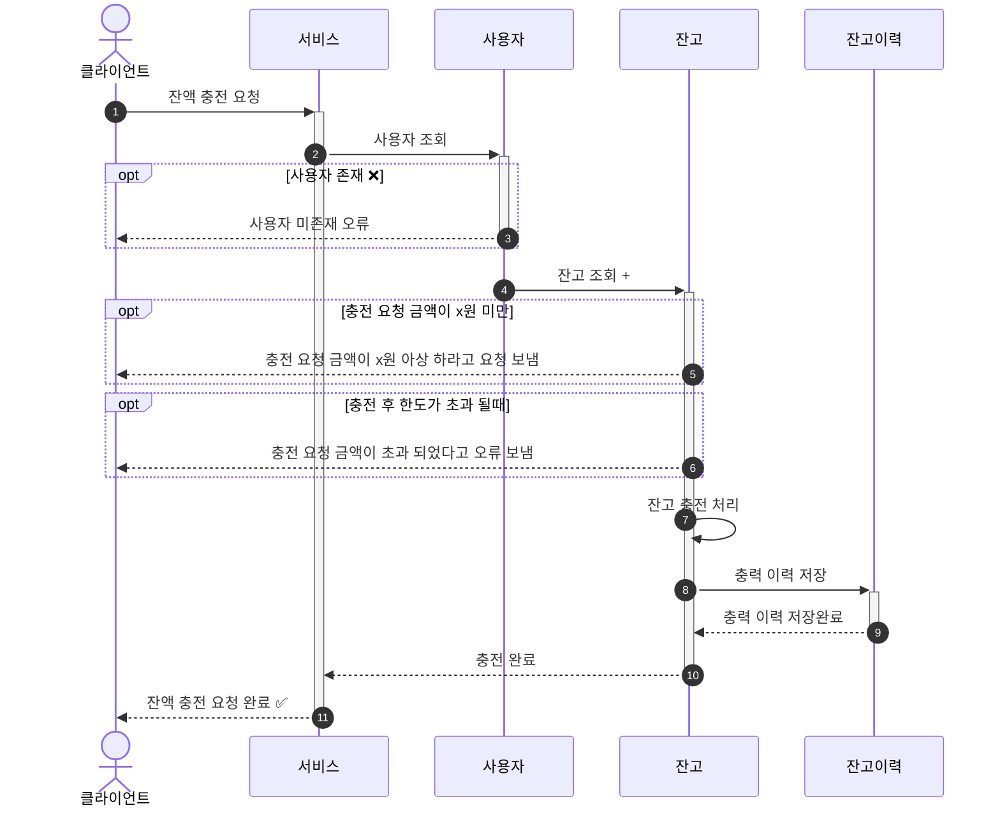
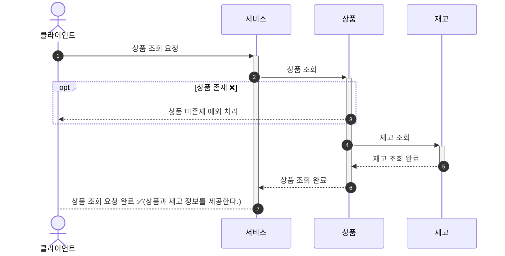
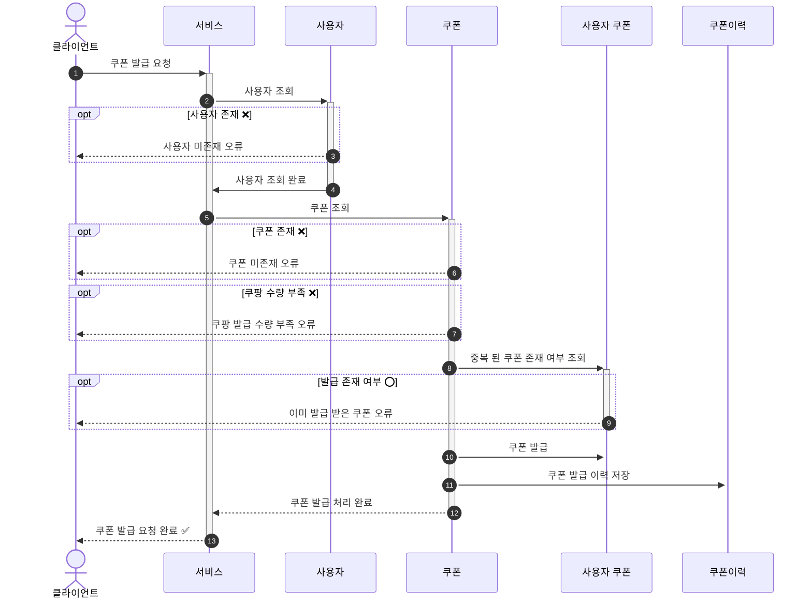
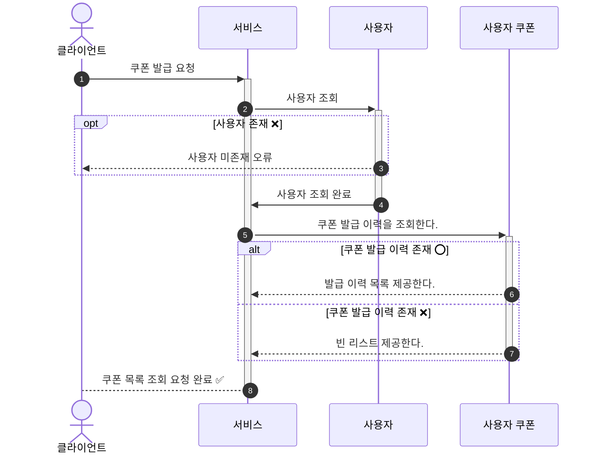
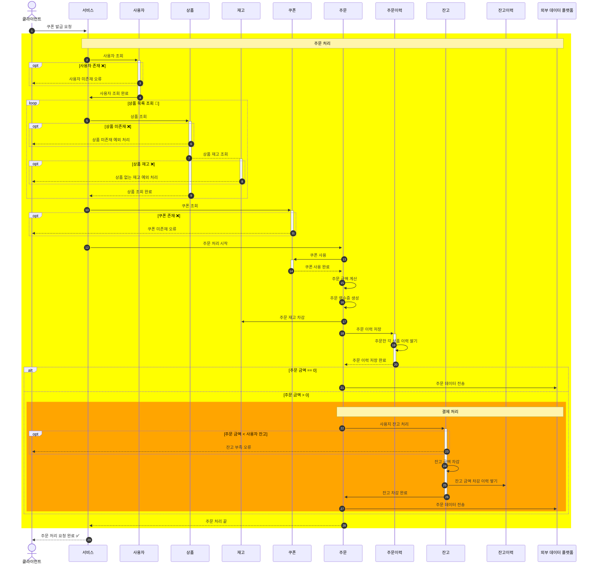
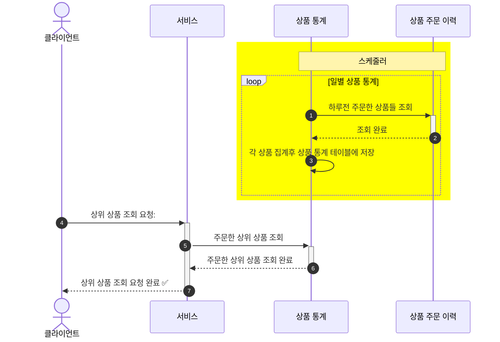

# 시퀀스 다이어그램

## 잔액
###  잔액 조회

1. 서비스에 요청한다.
2. 2~3 사용자 조회 하고 사용자 없으면 오류 보낸다.
3. 4~6 잔고를 조회해서 클라이언트한테 잔액을 제공한다.

###  잔액 충전

1. 서비스에 요청한다.
2. 2~3 사용자 조회 하고 사용자 없으면 오류 보낸다.
3. 4~7 잔고를 조회사 이상 없으면 충전 한다.
4. 8~9: 충전 아력을 저장한다.

## 상품
### 상품 조회

1. 서비스에 요청한다.
2. 2~3 상품 조회 하고 상품 없으면 오류 보낸다.
3. 4~5 재고 조회 한다.

## 쿠폰
### 쿠폰 발급

1. 서비스에 요청한다.
2. 2~4 사용자 조회 하고 사용자 없으면 오류 보낸다.
3. 5~9 쿠폰 가능 여부를 체크 한다.
4. 10~13 쿠폰 발급 처리 한다.

### 쿠폰 목록 조회 

1. 서비스에 요청한다.
2. 2~4 사용자 조회 하고 사용자 없으면 오류 보낸다.
3. 5~8 쿠폰 목록 조회 처리 한다.

### 주문

1. 서비스에 요청한다.
2. 2~4 사용자 조회 하고 사용자 없으면 오류 보낸다.
3. 5~9 상품 조회
4. 10~11 쿠폰 조회
5. 12 ~ 28 주문 처리
    - 12 ~ 20 주문 처리 
        - 13 ~ 16 주문서 생성
        - 17 상품 재고 차감
        - 18 ~ 19 주문 이력 쌓기
    - 21 ~ 27: 결제 처리

### 상위 상품 조회 및 스케줄러

1. 1~3 상품 통계처리
2. 4 ~ 7 상위 상품 조회