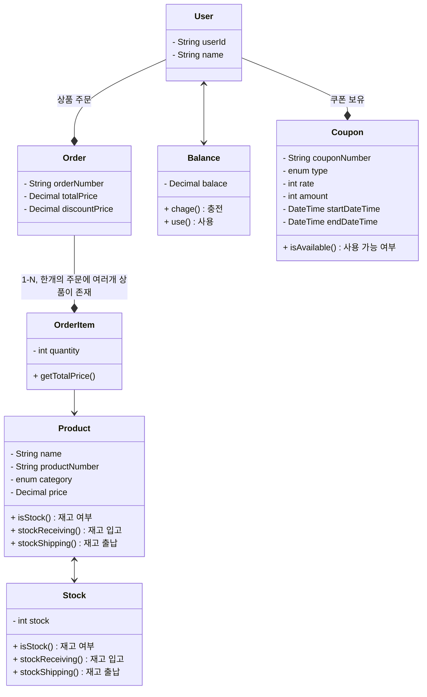

# 클래스 다이어그램

```mermaid
classDiagram
   User --* Order: 상품 주문
   User <--> Balance
   User --* Coupon: 쿠폰 보유
   Product <--> Stock
   Order --* OrderItem: 1-N, 한개의 주문에 여러개 상품이 존재
   OrderItem --> Product
    class User {
        - String userId
        - String name
        
    }
    class Balance{
        - Decimal balace
        + chage() 충전
        + use() 사용
    }
    
    class Product{
        - String name
        - String productNumber
        - enum category
        
        - Decimal price
        + isStock() 재고 여부
        + stockReceiving() 재고 입고
        + stockShipping() 재고 출납
    }
    
    class Stock{
        - int stock
        + isStock() 재고 여부
        + stockReceiving() 재고 입고
        + stockShipping() 재고 출납
    }
    
    class Coupon {
        - String couponNumber
        - enum type
        - int rate
        - int amount
        - DateTime startDateTime
        - DateTime endDateTime
        + isAvailable() 사용 가능 여부
    }
    
    class Order{
        - String orderNumber
        - Decimal totalPrice
        - Decimal discountPrice
    }
    
    class OrderItem{
        - int quantity
        + getTotalPrice()
    }
    
```