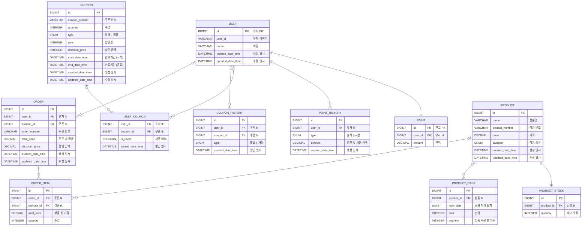

### ERD

### 테이블 목록
|name| description |
|----|-------------|
|`USER`| 사용자         |
|`POINT`| 사용자 잔고      |
|`POINT_HISTORY`| 사용자 잔고 이력   |
|`COUPON`| 쿠폰          |
|`USER_COUPON`| 사용자 보유 쿠폰   |
|`PRODUCT`| 상품          |
|`PRODUCT_STOCK`| 재고          |
|`ORDER`| 주문          |
|`ORDER_ITEM`| 주문 항목       |
|`ORDER_PRODUCT_HISTORY`| 상품 주문 이력    |
|`PRODUCT_RANK`| 상품 순위       |
