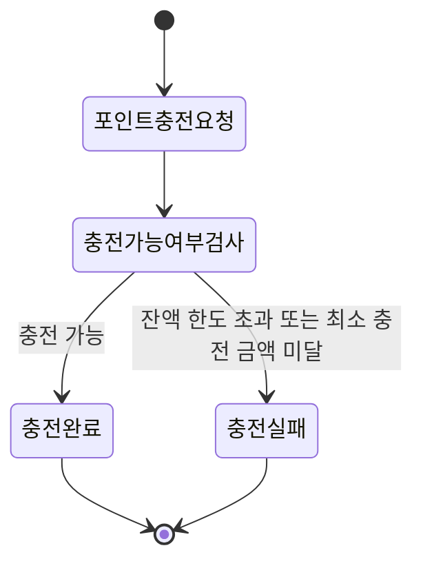
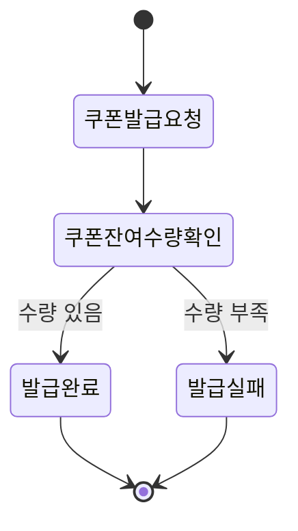
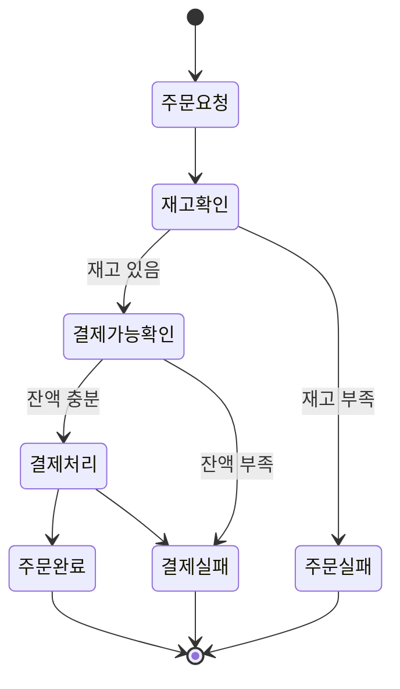
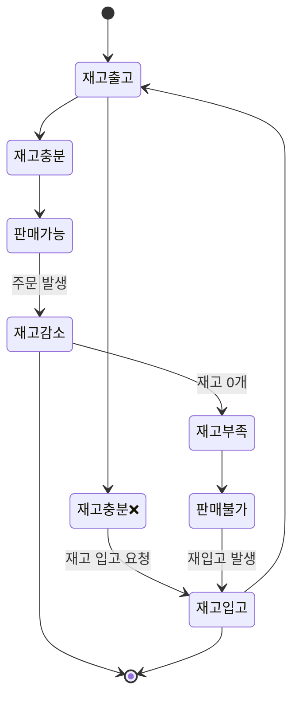

# 상태 다이어그램

## 충전

```mermaid
stateDiagram-v2
    [*] --> 포인트충전요청
    포인트충전요청 --> 충전가능여부검사
    충전가능여부검사 --> 충전완료 : 충전 가능
    충전가능여부검사 --> 충전실패 : 잔액 한도 초과 또는 최소 충전 금액 미달
    충전완료 --> [*]
    충전실패 --> [*]
```
## 쿠폰 발급

```mermaid
stateDiagram-v2
    [*] --> 쿠폰발급요청
    쿠폰발급요청 --> 쿠폰잔여수량확인
    쿠폰잔여수량확인 --> 발급완료 : 수량 있음
    쿠폰잔여수량확인 --> 발급실패 : 수량 부족
    발급완료 --> [*]
    발급실패 --> [*]
```
## 주문

```mermaid
stateDiagram-v2
    [*] --> 주문요청
    주문요청 --> 재고확인
    재고확인 --> 결제가능확인 : 재고 있음
    재고확인 --> 주문실패 : 재고 부족
    결제가능확인 --> 결제처리 : 잔액 충분
    결제가능확인 --> 결제실패 : 잔액 부족
    결제처리 --> 주문완료
    결제처리 --> 결제실패
    주문완료 --> [*]
    주문실패 --> [*]
    결제실패 --> [*]
```

## 상품 출고 처리

```mermaid
stateDiagram-v2
    [*] --> 재고출고
    재고출고 --> 재고충분 
    재고출고 --> 재고충분❌
    재고충분❌ --> 재고입고: 재고 입고 요청
    재고입고 --> 재고출고
    재고충분 --> 판매가능
    판매가능 --> 재고감소 : 주문 발생
    재고감소 --> 재고부족 : 재고 0개
    재고부족 --> 판매불가
    판매불가 --> 재고입고 : 재입고 발생
    재고감소 --> [*]
    재고입고 --> [*]
```