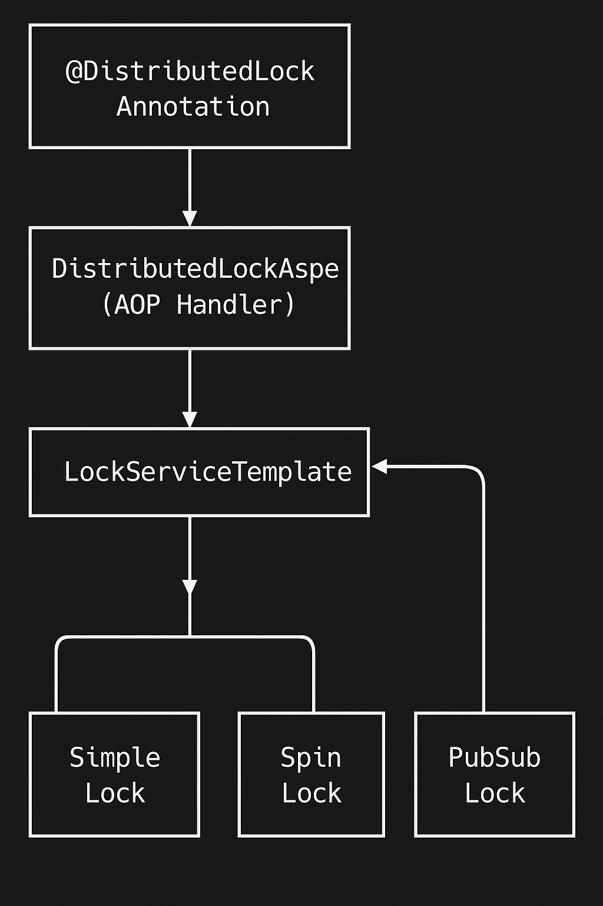

# Redis 기반 분산락 전략 보고서

## 1. 트랜잭션의 범위와 분산 환경에서의 Lock 이해

### 트랜잭션의 범위

트랜잭션은 데이터베이스의 상태를 변화시키는 하나의 논리적 작업 단위로, 작업의 완전성을 보장합니다. 트랜잭션은 다음과 같은 ACID 속성을 가집니다:

- **원자성(Atomicity)**: 트랜잭션 내의 모든 명령은 완벽히 수행되거나 아예 수행되지 않아야 함
- **일관성(Consistency)**: 트랜잭션 실행 전후의 데이터베이스는 일관된 상태를 유지해야 함
- **격리성(Isolation)**: 동시에 실행되는 트랜잭션들이 서로에게 영향을 미치지 않아야 함
- **지속성(Durability)**: 트랜잭션이 성공적으로 완료되면 그 결과는 영구적으로 반영되어야 함

그러나 단일 데이터베이스 트랜잭션으로는 분산 환경에서 발생하는 동시성 문제를 해결하기 어렵습니다. 이는 특히 여러 서버나 인스턴스가 동일한 리소스에 접근할 때 발생합니다.

### 비관락에서 분산락으로의 전환이 필요한 이유

기존 시스템에서는 쿠폰, 사용자 포인트, 재고, 사용자 쿠폰 등의 리소스에 대해 비관락(Pessimistic Lock)을 적용하고 있었습니다. 하지만 다음과 같은 이유로 분산 환경에서는 비관락만으로 충분하지 않습니다:

1. **단일 인스턴스 한계**: 
   - 비관락은 단일 데이터베이스 인스턴스 내에서만 효과적으로 작동
   - 여러 애플리케이션 서버가 분산 환경에서 동작할 때 다른 서버의 요청을 인식하지 못함

2. **DB 연결 및 자원 점유**: 
   - 비관락은 트랜잭션이 완료될 때까지 DB 연결을 점유하고 다른 트랜잭션 대기
   - 고부하 상황에서 DB 연결 풀 고갈 및 성능 저하 초래
   - 특히 주문이나 쿠폰 발급과 같은 긴 트랜잭션에서 문제 심화

3. **확장성 문제**: 
   - 비관락은 사용자 요청이 늘어날수록 락 경합이 증가하여 시스템 전체 처리량 감소
   - 특정 인기 리소스(예: 인기 상품 재고)에 대한 쓰기 작업이 모두 직렬화되는 병목 현상

4. **데드락 위험**: 
   - 여러 리소스에 액세스할 때 데드락 발생 위험
   - 분산 환경에서는 데드락 감지와 해결이 더 복잡해짐

5. **실패 시나리오 처리 어려움**: 
   - 트랜잭션 도중 서버 장애 발생 시 락이 해제되지 않고 남을 수 있음
   - 특히 선착순 쿠폰 발급과 같은 중요한 작업에서 시스템 전체 불능 초래 가능

6. **선착순 쿠폰과 같은 고경쟁 시나리오 대응 불가**: 
   - 비관락만으로는 "쿠폰 100개 한정" 같은 상황에서 정확한 재고 관리 불가능
   - 실제 사례에서 비관락 하에서 쿠폰이 초과 발급되는 문제 발생

### 분산 환경에서의 Lock

분산 환경에서는 다음과 같은 이유로 기존 데이터베이스 락으로는 충분하지 않습니다:

1. **서버 간 데이터 일관성**: 여러 서버가 동일한 데이터에 접근할 때 데이터베이스 트랜잭션만으로는 일관성 보장이 어려움
2. **성능 문제**: 데이터베이스 락은 오랜 시간 유지될 경우 성능 저하를 초래
3. **확장성 한계**: 많은 사용자가 동시에 접근할 때 락 경합이 증가하고 처리량이 감소

분산 락은 이러한 문제를 해결하기 위한 메커니즘으로, 여러 서버나 프로세스가 공유 리소스에 대한 접근을 조정할 수 있게 합니다.

## 2. 동시성 이슈 발생 원인 이해

### 동시성 이슈의 주요 원인

1. **Race Condition(경쟁 상태)**: 여러 프로세스가 동시에 같은 데이터에 접근하여 수정할 때 발생
2. **Lost Update(갱신 손실)**: 한 트랜잭션의 변경사항이 다른 트랜잭션에 의해 덮어쓰여질 때 발생
3. **Phantom Read(유령 읽기)**: 한 트랜잭션 내에서 동일한 쿼리를 실행했을 때 이전에 없던 레코드가 보이는 현상
4. **Dirty Read(오염된 읽기)**: 아직 커밋되지 않은 데이터를 다른 트랜잭션이 읽는 현상

### 현재 프로젝트의 동시성 이슈 사례

현재 프로젝트에서 발생하는 주요 동시성 이슈는 다음과 같습니다:

1. **쿠폰 발급 시 Race Condition**:
   - 선착순 쿠폰 발급 시 여러 사용자가 동시에 쿠폰을 발급받으려 할 때 쿠폰 재고가 정확히 관리되지 않음
   - 비관적 락만으로는 분산 환경에서 제대로 동작하지 않음

2. **재고 관리의 동시성 문제**:
   - 여러 사용자가 동시에 주문할 때 재고 부족 상태임에도 주문이 처리됨
   - 트랜잭션 내에서 재고 확인 후 차감 사이에 다른 트랜잭션이 끼어들어 발생

## 3. 적절한 분산락 키와 범위 선정

### 분산락 적용을 위한 키 선정 전략

분산락의 성능과 안정성은 적절한 락 키 선정에 크게 좌우됩니다. 현재 프로젝트에서는 다음과 같은 키 선정 전략을 사용합니다:

1. **리소스 기반 키 선정**: 동시 접근 제어가 필요한 리소스의 고유 식별자를 기반으로 락 키 생성
   - 예: `COUPON:{couponId}`, `STOCK:{productId}`

2. **키 선정 시 고려사항**:
   - **세분성(Granularity)**: 너무 광범위한 락은 성능 저하, 너무 세분화된 락은 관리가 복잡
   - **유일성(Uniqueness)**: 각 락 키는 보호하려는 리소스를 유일하게 식별해야 함
   - **가독성(Readability)**: 락 키는 어떤 리소스를 보호하는지 명확히 알 수 있어야 함

### 분산락 적용 범위

프로젝트에서 분산락이 필요한 주요 비즈니스 로직은 다음과 같습니다:

1. **쿠폰 발급 처리**
   - **락 키**: `COUPON:{couponId}`
   - **적용 위치**: `CouponFacade.issue()` 메서드
   - **보호 대상**: 특정 쿠폰의 재고 관리와 동시 발급 제어

2. **주문 처리 및 재고 관리**
   - **락 키**: `STOCK:{productId}` (여러 상품 주문 시 여러 키 사용)
   - **적용 위치**: `OrderFacade.order()` 메서드
   - **보호 대상**: 상품 재고의 동시 차감 제어

## 4. Redis 기반의 분산락 구현 전략

### RedisTemplate을 활용한 구현

현재 프로젝트에서는 Spring의 `RedisTemplate`과 Redisson 라이브러리를 활용해 세 가지 분산락 전략을 구현했습니다:

1. **Simple Lock**
2. **Spin Lock**
3. **Pub-Sub Lock (Redisson 기반)**

각 구현은 `LockServiceTemplate` 인터페이스를 상속받아 일관된 방식으로 사용할 수 있습니다.

### 분산락 구현 아키텍처



### Lock 획득 및 해제 프로세스

1. `@DistributedLock` 어노테이션으로 표시된 메서드 호출
2. AOP를 통해 해당 메서드 실행 전에 락 획득 시도
3. 락 획득 성공 시 메서드 실행, 실패 시 예외 발생
4. 메서드 실행 완료 후 락 해제 (finally 블록에서 보장)

## 5. 분산락 구현 전략 상세 분석

### Simple Lock 전략

```java
public <T> T executeWithLock(String key, Long waitTime, Long leaseTime, TimeUnit timeUnit, LockCallback<T> callback) throws Throwable {
    boolean acquired = false;
    try {
        // SETNX 명령어로 락 획득 시도 (값이 있으면 실패, 없으면 성공)
        acquired = lock(key, leaseTime, timeUnit);

        if (!acquired) {
            throw new IllegalStateException("Failed to acquire Simple lock for key: " + key);
        }

        return callback.doInLock();
    } finally {
        // 락 해제
        if (acquired) {
            unLock(key);
        }
    }
}

private boolean lock(String key, Long leaseTime, TimeUnit timeUnit) {
    return Boolean.TRUE.equals(redisTemplate.opsForValue()
            .setIfAbsent(key, String.valueOf(Thread.currentThread().getId()), leaseTime, timeUnit));
}

private void unLock(String key) {
    redisTemplate.delete(key);
}
```

#### 장점
- **구현이 단순함**: Redis의 SETNX 명령어를 이용한 간단한 구현
- **리소스 효율적**: 락 획득 실패 시 즉시 예외 발생하여 리소스 낭비 최소화

#### 단점
- **재시도 없음**: 락 획득 실패 시 즉시 예외를 발생시켜 재시도 기회 없음
- **대기 시간 지원 안함**: 락을 기다리는 메커니즘이 없어 요청 실패율이 높을 수 있음

### Spin Lock 전략

```java
public <T> T executeWithLock(String key, Long waitTime, Long leaseTime, TimeUnit timeUnit, LockCallback<T> callback) throws Throwable {
    boolean acquired = false;
    int retryCount = 0;

    try {
        while (!acquired) {
            acquired = lock(key, leaseTime, timeUnit);

            if (!acquired) {
                ++retryCount;
                if (retryCount > MAX_RETRIES) {
                    throw new IllegalStateException("락 획득 시도 횟수 초과: " + key);
                }
            }

            // 재시도 전 짧은 대기 (CPU 부하 방지)
            try {
                Thread.sleep(RETRY_DELAY_MS);
            } catch (InterruptedException e) {
                Thread.currentThread().interrupt();
                throw new IllegalStateException("락 획득 중 인터럽트 발생: " + key, e);
            }
        }
        
        return callback.doInLock();
    } finally {
        if (acquired) {
            unLock(key);
        }
    }
}
```

#### 장점
- **재시도 지원**: 락 획득에 실패해도 일정 횟수까지 재시도
- **짧은 대기 시간**: 락 획득이 가능하다면 스레드가 바로 락을 얻어서 작업할 수 있습니다.
- **Context switching 감소**: 락을 기다리는 동안 스레드가 CPU를 계속 사용하므로 Context switching이 발생하지 않습니다.

#### 단점
- **CPU 자원 소모**: 지속적인 재시도로 CPU 리소스 낭비 가능성
- **확장성 제한**: 부하가 높은 환경에서는 비효율적일 수 있음
- **데드락 가능성**: 여러 락을 얻을 때 순서가 보장되지 않으면 데드락 발생 가능

### Pub-Sub Lock 전략 (Redisson)

```java
public <T> T executeWithLock(String key, Long waitTime, Long leaseTime, TimeUnit timeUnit, LockCallback<T> callback) throws Throwable {
    RLock lock = redissonClient.getLock(key);
    Boolean acquired = false;
    try {
        acquired = lock.tryLock(waitTime, leaseTime, timeUnit);
        if (!acquired) {
            throw new IllegalStateException("락 획득 실패: " + key);
        }

        return callback.doInLock();
    } catch (InterruptedException e) {
        Thread.currentThread().interrupt();
        throw new IllegalStateException("Lock acquisition interrupted for key: " + key, e);
    } finally {
        if (acquired) {
            lock.unlock();
        }
    }
}
```

#### 장점
- **효율적인 대기**: Redis의 Pub/Sub 기능을 활용하여 락 해제 시 통지받음
- **자원 효율성**: 락이 해제될 때까지 효율적으로 대기 (스핀 락과 달리 지속적인 폴링 없음)

#### 단점
- **이벤트 흐름 추적 어려움**: 중개자(토픽)를 통해 메시지가 전달되기 때문에, 이벤트 흐름을 직접적으로 추적하기 어려울 수 있습니다. 
- **중개자 오버헤드**: 메시지 전달을 위해 중개자(토픽)가 필요하므로, 시스템 오버헤드가 발생할 수 있습니다
- **복잡한 설정**: 시스템을 구축하고 유지 관리하는 데 복잡한 설정이 필요할 수 있습니다

## 6. 분산락 적용 사례 분석

### 쿠폰 발급 프로세스

```java
@DistributedLock(key = "#command.getCouponId()", type = LockType.COUPON, strategy = LockStrategy.PUB_SUB_LOCK)
@Transactional
public void issue(CouponIssueCommand command) {
    DomainUser user = userService.findById(command.getUserId());
    DomainCoupon coupon = service.issueCoupon(command.getCouponId());
    userCouponService.issue(user.getId(), coupon.getId());
}
```

**동시성 이슈**:
- 선착순 쿠폰 발급 시 여러 사용자가 동시에 접근
- 쿠폰 수량이 제한된 경우 정확한 수량 관리 필요

**분산락 적용 효과**:
- `Pub/Sub Lock` 전략을 사용해 효율적인 락 획득 및 대기
- 쿠폰 ID를 키로 사용하여 특정 쿠폰에 대한 동시 접근 제어
- 트랜잭션과 결합하여 데이터 일관성 보장

### 주문 처리 및 재고 관리

```java
@DistributedLock(key = "#command.getProductIdsAsString()", type = LockType.STOCK, strategy = LockStrategy.PUB_SUB_LOCK)
@Transactional
public void order(OrderCommand command) {
    DomainUser user = userService.findById(command.getUserId());
    BigDecimal totalPrice = BigDecimal.ZERO;
    CreateOrder createOrder = new CreateOrder(command.getUserId(), createOrderNumber());

    for (OrderCommand.OrderItem item : command.getItems()) {
        DomainProduct product = productService.getProduct(item.getProductId());
        productStockService.delivering(product.getId(), item.getQuantity());
        
        DomainUserCoupon userCoupon = null;
        if (item.getCouponId() != null) {
            userCoupon = userCouponService.getUseCoupon(command.getUserId(), item.getProductId());
        }
        createOrder.addOrderItem(product, userCoupon, item.getQuantity());
    }

    DomainOrder order = service.create(createOrder);

    // 결제 처리
    if (order.getTotalPrice().compareTo(totalPrice) > 0) {
        pointService.use(command.getUserId(), totalPrice);
        pointHistoryService.useHistory(command.getUserId(), totalPrice);
    }

    // 외부 데이터 전송
    externalTransmissionService.sendOrderData();
}
```

**동시성 이슈**:
- 여러 사용자가 동시에 동일한 상품을 주문할 때 재고 부족 상태임에도 주문 처리
- 주문 처리 과정에서 재고 확인과 차감 사이에 다른 트랜잭션이 끼어들어 발생

**분산락 적용 효과**:
- 주문 시 관련된 모든 상품 ID를 키로 사용하여 재고에 대한 동시 접근 제어
- 트랜잭션 내에서 재고 확인과 차감이 원자적으로 이루어짐
- 여러 상품에 대한 멀티 락 적용으로 부분 주문 실패 방지

## 7. 성능 최적화 및 개선 사항

### 현재 구현의 장점

1. **AOP 기반 분리된 관심사**: 분산락 로직이 비즈니스 로직과 분리되어 유지보수성 향상
2. **전략 패턴 적용**: 다양한 락 전략을 상황에 맞게 선택할 수 있는 유연성
3. **표현력 있는 어노테이션**: `@DistributedLock` 어노테이션으로 직관적인 락 적용

### 개선 가능한 부분

1. **락 타임아웃 최적화**:
   - 현재 고정된 `waitTime`과 `leaseTime` 값을 각 비즈니스 로직에 맞게 조정
   - 빠른 처리가 필요한 작업은 짧은 `leaseTime`으로, 복잡한 작업은 긴 시간으로 설정

2. **세밀한 락 범위 조정**:
   - 현재 메서드 전체에 락을 적용하는 방식에서 더 세밀한 범위로 조정
   - 필요한 부분만 락을 적용하여 성능 향상

3. **장애 복구 메커니즘 개선**:
   - 락 획득 실패 시 재시도 정책 개선
   - 락 해제 실패에 대한 더 강건한 예외 처리

4. **모니터링 및 지표 수집**:
   - 락 획득/해제 시간, 대기 시간 등의 메트릭 수집
   - 성능 병목 지점 식별을 위한 모니터링 강화

## 8. 결론 및 권장사항

### 분산락 전략 선택 가이드라인

1. **Simple Lock**:
   - 간단한 동시성 제어가 필요한 경우
   - 락 경합이 낮은 상황에서 효율적

2. **Spin Lock**:
   - 락 획득 실패 시 재시도가 필요한 경우
   - 락 보유 시간이 매우 짧은 경우 (CPU 낭비 최소화)

3. **Pub/Sub Lock (Redisson)**:
   - 고부하 환경에서 효율적인 대기가 필요한 경우
   - 복잡한 락 시나리오 (다중 락, 락 승격 등)가 필요한 경우
   - **권장**: 대부분의 프로덕션 사례에 가장 적합

### 최종 권장사항

1. **쿠폰 발급 시스템**: 
   - 현재 적용된 Pub/Sub Lock 전략을 유지
   - 쿠폰 ID 기반 락 키 사용이 적절함

2. **주문 및 재고 관리**:
   - 현재 적용된 Pub/Sub Lock 전략 유지
   - 다중 상품 주문 시 데드락 방지를 위한 락 획득 순서 보장 유지

3. **포인트 관리**:
   - 사용자 포인트 변경 시에도 분산락 적용 고려
   - 락 키: `POINT:{userId}`

4. **추가 고려사항**:
   - 분산락 실패 시 사용자 경험 개선 (적절한 에러 메시지 및 재시도 안내)
   - 성능 모니터링 도구 도입으로 락 사용 패턴 분석
   - 주기적인 코드 리뷰로 불필요한 락 사용 최소화

분산 환경에서의 동시성 제어는 시스템의 일관성과 신뢰성을 보장하는 중요한 요소입니다. Redis 기반의 분산락을 통해 데이터베이스 락의 한계를 극복하고, 더 효율적이고 안정적인 서비스를 제공할 수 있습니다.