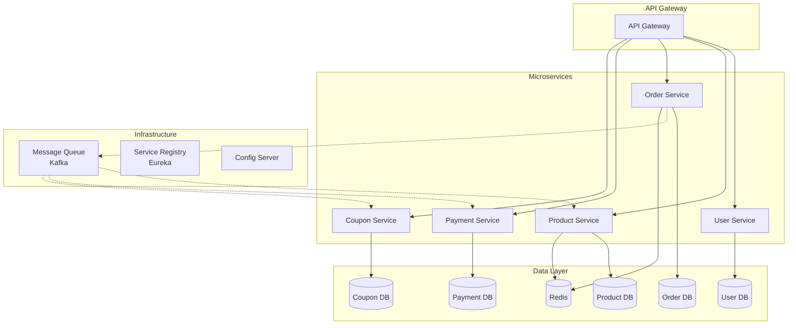
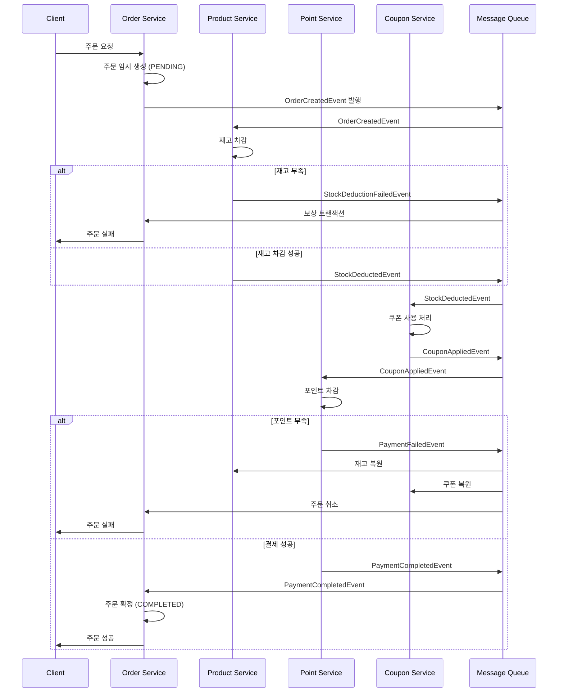
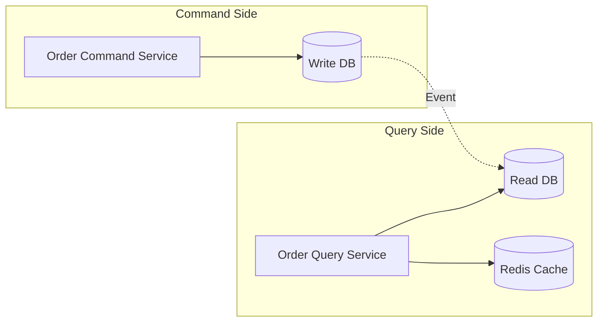
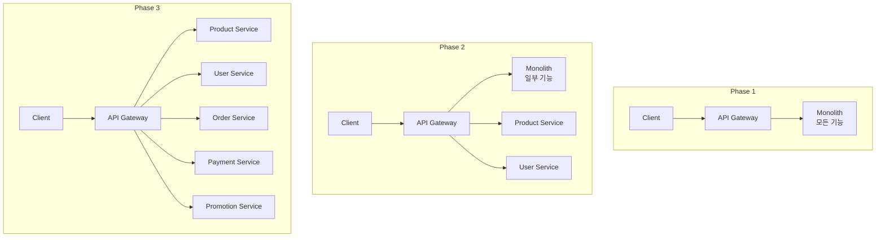

# 이커머스 서비스 MSA 전환 설계 보고서

## 1. 개요

현재 모놀리식 아키텍처로 구성된 이커머스 서비스를 마이크로서비스 아키텍처(MSA)로 전환하기 위한 설계 문서입니다. 본 문서에서는 도메인별 서비스 분리 방안과 분산 트랜잭션 처리 전략을 제시합니다.

## 2.MAS란
MSA는 **마이크로서비스 아키텍처(Microservice Architecture)**의 약자로, 복잡한 애플리케이션을 독립적인 작은 서비스들로 분리하여 개발하고 배포하는 방식을 말합니다. 각 서비스는 특정 기능을 담당하며, 서로 독립적으로 개발, 배포, 확장할 수 있다는 특징이 있습니다.  
MSA는 모놀리틱 시스템의 한계를 극복하고, 유연성, 확장성, 개발 생산성을 향상시키는 데 도움을 줍니다. 각 서비스는 독립적인 기술 스택을 사용할 수 있으며, 필요에 따라 개별적으로 배포하거나 확장할 수 있습니다. 또한, 서비스 간의 통신은 주로 경량화된 통신 프로토콜을 사용하며, 이는 배포 및 장애 복구에 유리합니다.


## 3. 현재 시스템 분석

### 3.1 현재 아키텍처
- **구조**: Layered Architecture 기반 모놀리식 애플리케이션
- **기술 스택**: Spring Boot, JPA, MySQL, Redis
- **주요 도메인**: User, Product, Order, Point, Coupon


### 3.2 도메인 간 의존성 분석
#### 3.2.1 현재 도매인 구조


- 주문
```
Order Domain
├── User Domain (회원 검증)
├── Product Domain (상품 정보, 재고 관리)
├── Point Domain (포인트 결제)
├── Coupon Domain (쿠폰 적용)
└── External Service (외부 데이터 전송)
```


## 4. MSA 전환이 필요한 이유

### 4.1 🔴 **확장성 문제 (Scalability Issues)**

#### 현재 문제점
```java
@DistributedLock(key = "#command.getProductIdsAsString()", 
                 type = LockType.STOCK, 
                 strategy = LockStrategy.PUB_SUB_LOCK)
@Transactional
public void order(OrderCommand command) {
    // 회원, 상품, 재고, 포인트, 쿠폰 모두 처리
}
```

- **문제**: 주문이 몰리면 전체 시스템이 영향받음
- **증상**: Black Friday 같은 이벤트 시 전체 서비스 장애 위험
- **MSA 해결책**: 각 서비스별 독립적 스케일링 가능

### 4.2 🔴 **도메인 간 강한 결합도 (Tight Coupling)**

#### 주문 프로세스의 복잡한 의존성
```java
public void order(OrderCommand command) {
    // 1. 회원 검증
    userService.findById(command.getUserId());
    
    // 2. 상품 & 재고 처리
    productService.getProduct(item.getProductId());
    productStockService.delivering(product.getId(), item.getQuantity());
    
    // 3. 쿠폰 처리
    userCouponService.getUseCoupon(userId, productId);
    
    // 4. 포인트 결제
    pointService.use(userId, order.getTotalPrice());
    
    // 5. 외부 전송
    eventPublisher.publishEvent(OrderEvent.created(order));
}
```

- **문제**: 하나의 도메인 변경이 전체 시스템에 영향
- **리스크**: 쿠폰 시스템 장애 → 전체 주문 불가
- **MSA 해결책**: 서비스별 독립적 배포 및 장애 격리

### 4.3 🔴 **배포 주기의 비효율성 (Deployment Bottleneck)**

#### 현재 상황
- 상품 팀이 랭킹 로직 수정 → 전체 서비스 재배포
- 결제 팀이 포인트 정책 변경 → 전체 서비스 재배포
- 쿠폰 팀이 새 기능 추가 → 전체 서비스 재배포

**MSA 해결책**: 각 팀이 독립적으로 배포 가능

### 4.4 🟡 **성능 최적화의 한계**

#### 캐시 설정의 복잡성
```java
@Bean
public CacheManager cacheManager() {
    Map<String, RedisCacheConfiguration> cacheConfigurations = new HashMap<>();
    
    // 도메인별로 다른 TTL 필요
    cacheConfigurations.put("productRanks", config.entryTtl(Duration.ofHours(25)));
    cacheConfigurations.put("topProducts", config.entryTtl(Duration.ofHours(100)));
    cacheConfigurations.put("coupons", config.entryTtl(Duration.ofMinutes(30)));
    cacheConfigurations.put("userCoupons", config.entryTtl(Duration.ofMinutes(10)));
}
```

**MSA 해결책**: 각 서비스가 자체 캐시 전략 최적화


## 4. MSA 서비스 분리 설계

### 4.1 마이크로서비스 분리 전략

#### 4.1.1 서비스 경계 정의
Domain Driven Design(DDD)의 Bounded Context를 기반으로 다음과 같이 서비스를 분리합니다:

1. **User Service** (회원 서비스)
   - 회원 정보 관리
   - 회원 인증/인가
   - Database: user, user_coupon 테이블

2. **Product Service** (상품 서비스)
   - 상품 정보 관리
   - 상품 재고 관리
   - 상품 랭킹 관리
   - Database: product, product_stock, product_rank 테이블

3. **Order Service** (주문 서비스)
   - 주문 처리
   - 주문 이력 관리
   - Database: order, order_item, order_product_history 테이블

4. **Payment Service** (결제 서비스)
   - 포인트 관리
   - 결제 처리
   - Database: point, point_history 테이블

5. **Promotion Service** (프로모션 서비스)
   - 쿠폰 관리
   - 쿠폰 발급/사용
   - Database: coupon, user_coupon(마이그레이션 필요) 테이블

### 4.2 서비스 아키텍처 다이어그램



## 5. 분산 트랜잭션 처리 전략

### 5.1 주문 프로세스의 트랜잭션 문제

현재 주문 프로세스는 하나의 트랜잭션으로 처리되는 다음 작업들이 MSA에서는 분산됩니다:

1. 재고 차감 (Product Service)
2. 쿠폰 사용 처리 (Promotion Service)
3. 포인트 차감 (Payment Service)
4. 주문 생성 (Order Service)
5. 외부 시스템 전송 (External Service)

### 5.2 Saga Pattern 적용

#### 5.2.1 Choreography-based Saga
이벤트 기반으로 각 서비스가 자율적으로 동작하는 방식을 채택합니다.



### 5.3 보상 트랜잭션 설계

#### 5.3.1 각 서비스별 보상 트랜잭션

**Product Service**
- 정상 트랜잭션: 재고 차감
- 보상 트랜잭션: 재고 복원
- 멱등성 보장: 주문번호 기반 중복 처리 방지

**Promotion Service**
- 정상 트랜잭션: 쿠폰 사용 처리
- 보상 트랜잭션: 쿠폰 사용 취소
- 멱등성 보장: 쿠폰 ID와 주문번호 조합으로 중복 방지

**Payment Service**
- 정상 트랜잭션: 포인트 차감
- 보상 트랜잭션: 포인트 환불
- 멱등성 보장: 트랜잭션 ID 기반 중복 방지

#### 5.3.2 이벤트 저장소 (Event Store)

```sql
CREATE TABLE saga_event_log (
    id BIGINT AUTO_INCREMENT PRIMARY KEY,
    saga_id VARCHAR(36) NOT NULL,
    service_name VARCHAR(50) NOT NULL,
    event_type VARCHAR(100) NOT NULL,
    event_data JSON,
    status ENUM('PENDING', 'COMPLETED', 'FAILED', 'COMPENSATED'),
    created_at TIMESTAMP DEFAULT CURRENT_TIMESTAMP,
    INDEX idx_saga_id (saga_id),
    INDEX idx_status (status)
);
```

### 5.4 분산 잠금 처리

현재 Redis를 활용한 분산 잠금이 구현되어 있으므로, 이를 활용하여 동시성 제어를 수행합니다.

```java
@Component
public class DistributedStockManager {
    
    @DistributedLock(key = "#productId", type = LockType.STOCK)
    public void deductStock(Long productId, int quantity) {
        // 재고 차감 로직
    }
}
```

## 6. 데이터 일관성 보장 방안

### 6.1 Eventually Consistent 설계

- **Immediate Consistency 불필요 영역**: 상품 랭킹, 통계 데이터
- **Strong Consistency 필요 영역**: 재고, 포인트 잔액

### 6.2 CQRS (Command Query Responsibility Segregation) 적용
#### 6.2.1 CQRS 패턴이란
CQRS는 명령(Command)과 조회(Query)의 책임을 분리하는 아키텍처 패턴

- Command (명령): 데이터를 변경하는 작업 (CREATE, UPDATE, DELETE)
- Query (조회): 데이터를 읽는 작업 (READ)




### 6.3 이벤트 소싱 고려사항

주문 상태 변경 이벤트를 모두 저장하여 감사(Audit) 및 디버깅에 활용:

```java
public enum OrderEventType {
    ORDER_CREATED,
    STOCK_DEDUCTED,
    COUPON_APPLIED,
    PAYMENT_COMPLETED,
    ORDER_CONFIRMED,
    ORDER_CANCELLED
}
```

## 7. 서비스 간 통신 전략

### 7.1 동기 통신 (REST API)
- 실시간 조회가 필요한 경우
- Circuit Breaker 패턴 적용 (Resilience4j)
- Timeout 설정: 3초

### 7.2 비동기 통신 (Message Queue)
- 주문 프로세스와 같은 긴 트랜잭션
- 이벤트 기반 통신
- Kafka 또는 RabbitMQ 사용

### 7.3 Service Mesh 고려
- Istio를 통한 서비스 간 통신 관리
- 트래픽 관리, 보안, 관찰성 향상

## 8. 마이그레이션 전략

### 8.1 단계별 전환 계획

**Phase 1: 읽기 전용 서비스 분리 **
- Product Service의 조회 API 분리
- 기존 모놀리스와 병행 운영

**Phase 2: 독립적 도메인 분라**
- User Service 분리
- Promotion Service 분리

**Phase 3: 핵심 트랜잭션 분리**
- Payment Service 분리
- Order Service 분리
- Saga 패턴 구현

**Phase 4: 레거시 제거**
- 모놀리스 애플리케이션 제거
- 모니터링 및 안정화

### 8.2 Strangler Fig Pattern 적용



## 9. 모니터링 및 운영 전략

### 9.1 분산 추적 (Distributed Tracing)
- Zipkin 또는 Jaeger 도입
- 전체 요청 흐름 추적
- 병목 구간 식별

### 9.2 중앙 집중식 로깅
- ELK Stack (Elasticsearch, Logstash, Kibana)
- 구조화된 로그 포맷 (JSON)
- Correlation ID를 통한 요청 추적

### 9.3 메트릭 수집
- Prometheus + Grafana
- 주요 메트릭: TPS, 응답시간, 에러율, 리소스 사용률

## 10. 예상 문제점 및 해결 방안

### 10.1 네트워크 지연
- **문제**: 서비스 간 통신으로 인한 지연 증가
- **해결**:
   - 적절한 캐싱 전략
   - 배치 API 제공
   - GraphQL 도입 고려

### 10.2 데이터 정합성
- **문제**: 분산 환경에서의 데이터 일관성
- **해결**:
   - Saga 패턴 적용
   - 이벤트 소싱
   - 보상 트랜잭션

### 11.3 운영 복잡도 증가
- **문제**: 서비스 수 증가로 인한 관리 부담
- **해결**:
   - CI/CD 파이프라인 자동화
   - 컨테이너 오케스트레이션 (Kubernetes)
   - 표준화된 서비스 템플릿

## 11. 성능 및 확장성 고려사항

### 11.1 API Gateway 성능
- 캐싱 적용
- Rate Limiting
- 요청 라우팅 최적화

### 11.2 데이터베이스 샤딩
- Product Service: 카테고리별 샤딩
- Order Service: 시간 기반 파티셔닝
- User Service: User ID 기반 샤딩

### 11.3 Auto Scaling
- CPU/Memory 기반 HPA (Horizontal Pod Autoscaler)
- 이벤트 큐 길이 기반 스케일링
- 예측 기반 스케일링

## 12. 보안 고려사항

### 12.1 서비스 간 인증
- mTLS (mutual TLS) 적용
- Service Account 기반 인증

### 12.2 API 보안
- OAuth 2.0 / JWT 토큰
- API Key 관리
- Rate Limiting

### 12.3 데이터 암호화
- 전송 중 암호화: TLS 1.3
- 저장 시 암호화: DB 레벨 암호화

## 13. 결론

본 MSA 전환은 시스템의 확장성과 유지보수성을 크게 향상시킬 것으로 기대됩니다. 특히 Saga 패턴을 통한 분산 트랜잭션 처리와 이벤트 기반 아키텍처는 시스템의 탄력성을 높이고, 각 서비스의 독립적인 배포와 확장을 가능하게 합니다.

단계적 마이그레이션 전략을 통해 리스크를 최소화하면서도, 각 단계에서 얻은 경험을 다음 단계에 반영할 수 있도록 설계했습니다. 무엇보다 비즈니스 연속성을 보장하면서 점진적으로 전환하는 것이 핵심입니다.
