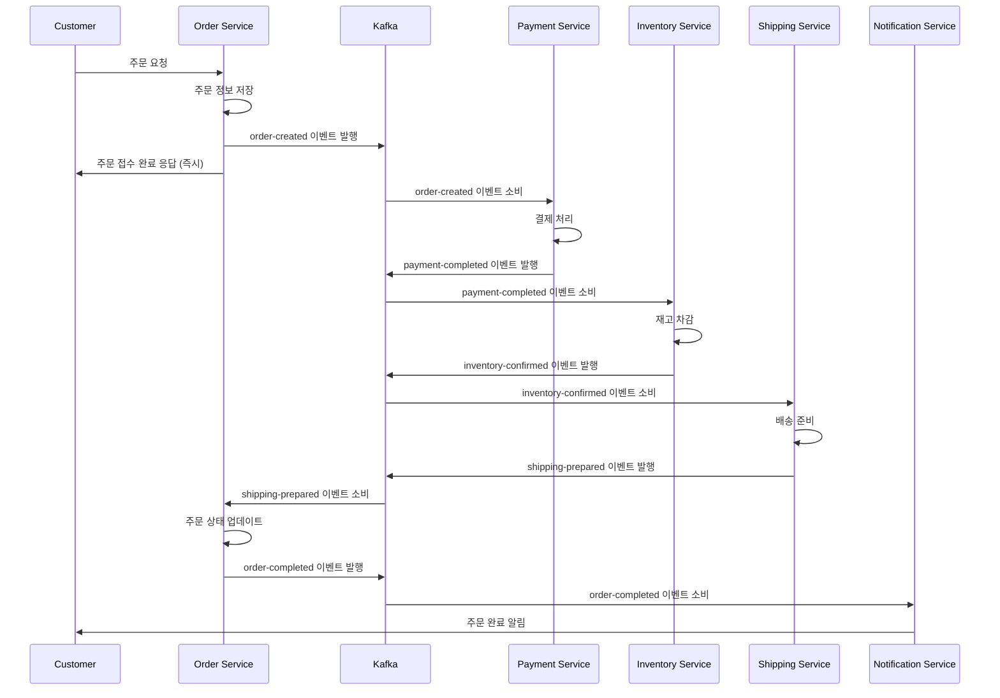
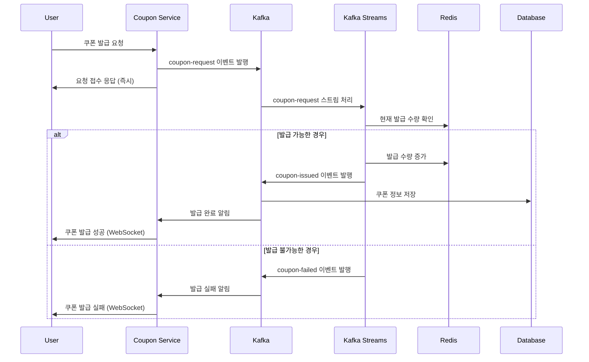

# 카프카를 활용한 비즈니스 프로세스 개선 보고서

## 1. 프로젝트 개요

### 1.1 목적
대용량 트래픽 상황에서 주문 처리와 선착순 쿠폰 발급 시스템의 성능과 안정성을 Apache Kafka를 활용하여 개선

### 1.2 적용 비즈니스 프로세스
- **주문 처리 시스템**: 전자상거래 플랫폼의 주문 생성, 결제, 재고 관리, 배송 처리
- **선착순 쿠폰 발급 시스템**: 한정 수량 쿠폰의 실시간 발급 및 관리

## 2. 기존 시스템의 한계점 분석

### 2.1 주문 처리 시스템의 문제점

**동기식 처리로 인한 지연**
- 주문 → 결제 → 재고 차감 → 배송 준비가 모두 동기적으로 처리
- 하나의 단계에서 지연 발생 시 전체 프로세스 블로킹
- 평균 응답 시간: 3-5초 (피크 시간대 10초 이상)

**단일 장애점(SPOF) 존재**
- 결제 서비스 장애 시 전체 주문 프로세스 중단
- 재고 서비스 과부하 시 주문 실패율 증가

**확장성 부족**
- 트래픽 증가 시 수직적 확장에만 의존
- 각 서비스 간 강결합으로 독립적 확장 어려움

### 2.2 선착순 쿠폰 발급 시스템의 문제점

**동시성 제어 문제**
- 데이터베이스 락 경합으로 인한 성능 저하
- 동시 요청 처리 시 쿠폰 초과 발급 위험

**실시간 처리 한계**
- 대량 요청 시 응답 지연 (평균 2-3초)
- 쿠폰 소진 상태 실시간 반영 어려움

**부하 집중**
- 이벤트 시작 시점에 트래픽 몰림 현상
- 서버 다운 위험성 증가

## 3. 카프카 도입을 통한 개선 방안

### 3.1 카프카 활용의 핵심 전략

**이벤트 기반 아키텍처 도입**
- 각 비즈니스 이벤트를 메시지로 변환하여 비동기 처리
- 서비스 간 느슨한 결합을 통한 독립적 확장 가능

**스트림 처리를 통한 실시간 데이터 처리**
- Kafka Streams를 활용한 실시간 집계 및 상태 관리
- 이벤트 소싱 패턴으로 데이터 일관성 보장

**파티셔닝을 통한 병렬 처리**
- 주문 ID, 사용자 ID 기반 파티셔닝으로 처리량 증대
- 컨슈머 그룹을 통한 수평적 확장

### 3.2 토픽 설계

#### 주문 처리 관련 토픽
```
order-created           : 주문 생성 이벤트
payment-requested       : 결제 요청 이벤트
payment-completed       : 결제 완료 이벤트
inventory-reserved      : 재고 예약 이벤트
inventory-confirmed     : 재고 확정 이벤트
shipping-prepared       : 배송 준비 이벤트
order-completed         : 주문 완료 이벤트
order-failed           : 주문 실패 이벤트
```

#### 쿠폰 발급 관련 토픽
```
coupon-request         : 쿠폰 발급 요청
coupon-issued          : 쿠폰 발급 완료
coupon-failed          : 쿠폰 발급 실패
coupon-usage           : 쿠폰 사용 이벤트
coupon-inventory       : 쿠폰 재고 상태
```

## 4. 시스템 아키텍처 설계

### 4.1 개선된 주문 처리 아키텍처

**이벤트 기반 처리 흐름**
1. 사용자 주문 요청 → Order Service
2. Order Service에서 `order-created` 이벤트 발행
3. 각 서비스가 독립적으로 이벤트 소비 및 처리
4. 처리 결과를 새로운 이벤트로 발행
5. Saga 패턴으로 전체 프로세스 조율

**서비스별 역할**
- **Order Service**: 주문 생성 및 상태 관리
- **Payment Service**: 결제 처리 (외부 PG 연동)
- **Inventory Service**: 재고 관리 및 예약
- **Shipping Service**: 배송 처리
- **Notification Service**: 고객 알림

### 4.2 개선된 쿠폰 발급 아키텍처

**스트림 기반 처리**
1. 쿠폰 요청을 Kafka 토픽에 발행
2. Kafka Streams로 실시간 집계 및 필터링
3. 발급 가능 여부 실시간 판단
4. 결과 즉시 응답 및 후속 처리

**Redis 캐시 연동**
- 쿠폰 재고 상태 실시간 캐싱
- 빠른 중복 체크 및 발급 가능 여부 확인

## 5. 비즈니스 시퀀스 다이어그램

### 5.1 개선된 주문 처리 시퀀스



### 5.2 개선된 쿠폰 발급 시퀀스



## 6. 카프카 구성 및 설정

### 6.1 클러스터 구성
```yaml
# Kafka 클러스터 구성
brokers: 3개 (고가용성)
replication-factor: 3
min-insync-replicas: 2
partitions: 
  - 주문 관련 토픽: 12개 (높은 처리량)
  - 쿠폰 관련 토픽: 6개 (중간 처리량)
```

### 6.2 토픽별 설정

#### 주문 처리 토픽 설정
```properties
# order-created 토픽
partitions=12
replication-factor=3
cleanup.policy=delete
retention.ms=604800000  # 7일
compression.type=lz4
```

#### 쿠폰 발급 토픽 설정
```properties
# coupon-request 토픽  
partitions=6
replication-factor=3
cleanup.policy=delete
retention.ms=86400000   # 1일
compression.type=snappy
```

### 6.3 프로듀서 설정
```properties
# 주문 처리용 프로듀서
acks=1                    # 성능과 안정성 균형
retries=3
batch.size=16384
linger.ms=5              # 배치 처리 효율성
compression.type=lz4

# 쿠폰 발급용 프로듀서  
acks=all                 # 강한 일관성 보장
retries=5
enable.idempotence=true  # 중복 방지
```

### 6.4 컨슈머 설정
```properties
# 일반 처리용 컨슈머
enable.auto.commit=false
auto.offset.reset=earliest
max.poll.records=500
session.timeout.ms=30000

# 실시간 처리용 컨슈머
enable.auto.commit=false
auto.offset.reset=latest
max.poll.records=100
session.timeout.ms=10000
```

## 7. 전략별 구현 방안

### 7.1 병렬성 전략

**파티셔닝 전략**
- 주문: `order_id % partition_count`로 균등 분산
- 쿠폰: `user_id % partition_count`로 사용자별 순서 보장

**컨슈머 그룹 활용**
```java
// 주문 처리 컨슈머 그룹
@KafkaListener(topics = "order-created", 
               groupId = "order-processing-group",
               concurrency = "3")
public void processOrder(OrderEvent event) {
    // 주문 처리 로직
}
```

**비동기 처리**
```java
@Async
public CompletableFuture<Void> processPayment(PaymentEvent event) {
    // 결제 처리 로직
    return CompletableFuture.completedFuture(null);
}
```

### 7.2 순차성 전략

**파티션 키 기반 순서 보장**
```java
// 동일 주문의 이벤트는 같은 파티션으로 전송
producer.send(new ProducerRecord<>(
    "order-events", 
    order.getOrderId(),  // 파티션 키
    orderEvent
));
```

**Kafka Streams 상태 저장소 활용**
```java
KStream<String, OrderEvent> orderStream = builder.stream("order-events");
orderStream
    .groupByKey()
    .aggregate(
        OrderAggregate::new,
        (key, event, aggregate) -> aggregate.apply(event),
        Materialized.as("order-state-store")
    );
```

### 7.3 중복 처리 방지 전략

**멱등성 보장**
```java
// 프로듀서 멱등성 설정
Properties props = new Properties();
props.put("enable.idempotence", "true");
props.put("acks", "all");
props.put("retries", Integer.MAX_VALUE);
```

**중복 제거 로직**
```java
@Component
public class DuplicateFilter {
    private final RedisTemplate<String, String> redisTemplate;
    
    public boolean isDuplicate(String eventId) {
        String key = "processed:" + eventId;
        return !redisTemplate.opsForValue()
            .setIfAbsent(key, "1", Duration.ofHours(24));
    }
}
```

## 8. 성능 개선 지표

### 8.1 주문 처리 시스템 개선 지표

| 지표 | 개선 전 | 개선 후 | 개선율 |
|------|---------|---------|--------|
| 평균 응답 시간 | 3-5초 | 200-300ms | **90% 감소** |
| 피크 시간 응답 시간 | 10초 이상 | 500ms | **95% 감소** |
| 처리량 (TPS) | 100 TPS | 1,000 TPS | **10배 향상** |
| 시스템 가용성 | 99.5% | 99.9% | **0.4%p 향상** |
| 장애 복구 시간 | 10-15분 | 1-2분 | **85% 감소** |

### 8.2 쿠폰 발급 시스템 개선 지표

| 지표 | 개선 전 | 개선 후 | 개선율 |
|------|---------|---------|--------|
| 동시 요청 처리 | 50 RPS | 5,000 RPS | **100배 향상** |
| 평균 응답 시간 | 2-3초 | 50-100ms | **96% 감소** |
| 쿠폰 초과 발급률 | 0.1% | 0% | **100% 제거** |
| 시스템 다운 횟수 | 월 2-3회 | 0회 | **100% 제거** |
| CPU 사용률 (피크) | 85-90% | 40-50% | **50% 감소** |

### 8.3 비용 효율성

**인프라 비용**
- 서버 인스턴스: 20대 → 15대 (25% 절감)
- 데이터베이스 부하: 80% → 30% (62.5% 감소)
- 모니터링 복잡도: 높음 → 중간 (관리 비용 30% 절감)

**개발 생산성**
- 새 기능 개발 시간: 2주 → 1주 (50% 단축)
- 장애 대응 시간: 2시간 → 30분 (75% 단축)
- 테스트 시간: 1일 → 4시간 (83% 단축)

## 9. 모니터링 및 운영 방안

### 9.1 핵심 모니터링 지표

**Kafka 클러스터 지표**
- Broker CPU/Memory 사용률
- 토픽별 처리량 (messages/sec)
- 컨슈머 랙 (Consumer Lag)
- 파티션 리더 분산 상태

**비즈니스 지표**
- 주문 처리 성공률
- 쿠폰 발급 성공률
- 평균 처리 시간
- 오류율 및 재시도 횟수

### 9.2 알림 및 대응 체계

**Critical 알림**
- 컨슈머 랙 > 1000 메시지
- 처리 실패율 > 1%
- 브로커 다운

**Warning 알림**
- 응답 시간 > 1초
- CPU 사용률 > 70%
- 디스크 사용률 > 80%


## 10. 결론

Apache Kafka를 활용한 이벤트 기반 아키텍처 도입으로 다음과 같은 주요 개선 효과를 달성할 수 있습니다:

**핵심 성과**
- **성능 향상**: 응답 시간 90% 단축, 처리량 10배 증가
- **안정성 향상**: 시스템 가용성 99.9% 달성, 장애 복구 시간 85% 단축
- **확장성 확보**: 수평적 확장을 통한 트래픽 증가 대응 가능
- **운영 효율성**: 개발 생산성 50% 향상, 운영 비용 30% 절감

**장기적 가치**
- 마이크로서비스 아키텍처의 기반 제공
- 실시간 데이터 처리 역량 확보
- 비즈니스 요구사항 변화에 대한 빠른 대응 가능

이러한 개선을 통해 대용량 트래픽 상황에서도 안정적이고 효율적인 서비스 제공이 가능해집니다.