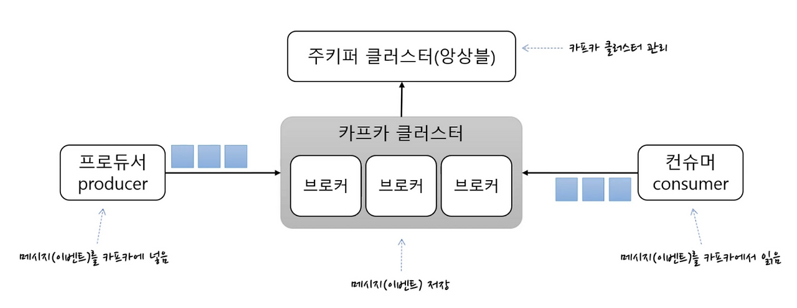
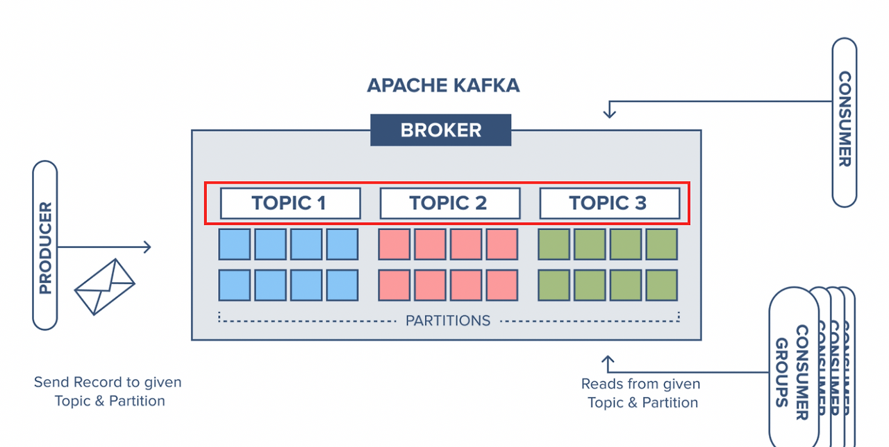
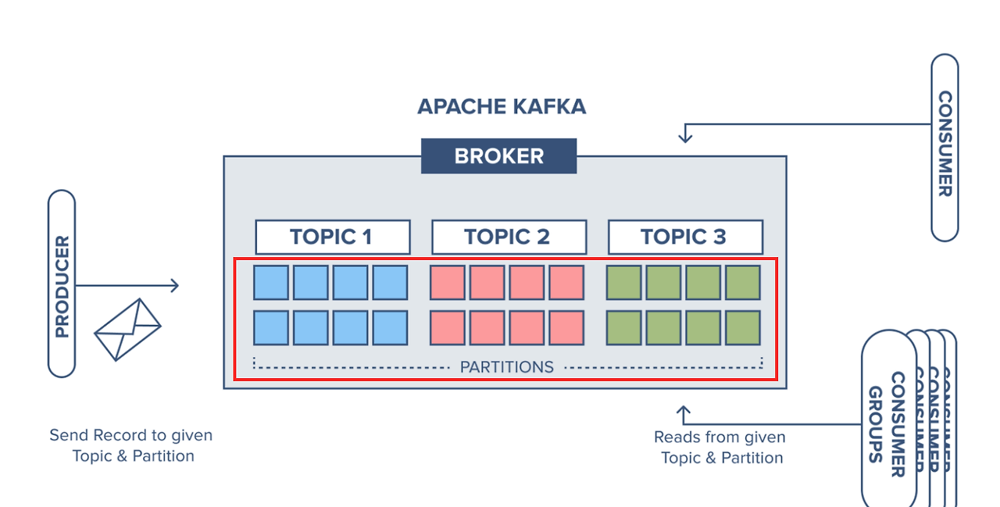
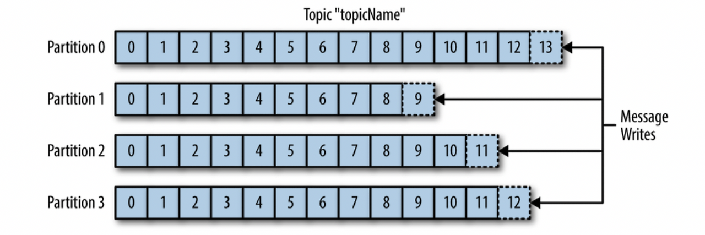

# Kafka 기초 개념 학습

## 1. Apache Kafka란?

Apache Kafka는 대용량의 실시간 데이터 스트림 처리를 위한 고성능 분산 이벤트 스트리밍 플랫품이며 PUB-SUB 모델의 메시지 큐 형태로 동작을 합니다. 카프카는 높은 처리량과 낮은 지연 시간을 제공하여 실시간 데이터 처리에 적합하며, 분산 아키텍처로 설계되어 확장성과 내고장성을 가지고 있습니다.


### 1.1 Message Queue?
카프카는 메시지 큐형태로 되어 있다고 했는데..  
메시지 큐(Messqge Queue: MQ)는 메시지 기반의 미들웨어(서로 다른 애플리케이션이 서로 통시하는데 사용되는 소프트웨어)로, 메시지를 이용하여 여러 애플리케이션 및 서비스들을 연결해줍니다.  
메시지 지향 미들웨어(Message Oriented Middleware: MOM)를 구현한 시스템입니다.  
메시지 큐는 메시지를 임시로 저장하는 간단한 버퍼라고 생각할 수도 있습니다. 메시지를 전송 및 수신하기 위해 중간에 메시지 큐를 둡니다.
메시지 큐는 데이터를 가져가는 쪽(Consumer)이 실제로 언제 메시즈를 가져가서 처리할지는 보장하지 않습니다.  
이러한 비동기적 특성이 존재하여, Queue에 넣어둔 데이터들을 나중에 처리할 수 있습니다.  


### 1.2 카프카 주요 특징
- **높은 처리량(High Throughput)**: 초당 수백만 건의 메시지 처리 가능
- **확장성(Scalability)**: 수평적 확장을 통한 대용량 데이터 처리
- **내구성(Durability)**: 디스크에 데이터를 저장하여 장애 시에도 데이터 보존
- **실시간 처리**: 낮은 지연시간으로 실시간 데이터 스트리밍 지원

## 2. Kafka 핵심 구성요소

### 2.1 Broker (브로커)
- Kafka 클러스터의 각 서버 인스턴스
- 메시지를 저장하고 클라이언트의 요청을 처리
- 일반적으로 3개 이상의 브로커로 클러스터 구성 (고가용성)

!

### 2.2 Topic (토픽)
- 메시지가 저장되는 논리적 단위
- 데이터베이스의 테이블과 유사한 개념
- 메시지의 카테고리 또는 분류 기준




**예시:**
- `order-events`: 주문 관련 이벤트
- `user-activity`: 사용자 활동 로그
- `payment-notifications`: 결제 알림

### 2.3 Partition (파티션)
- 토픽을 물리적으로 분할한 단위
- 병렬 처리와 확장성을 위해 사용
- 각 파티션은 순서가 보장되는 불변의 메시지 시퀀스



**파티션의 장점:**
- **병렬 처리**: 여러 컨슈머가 동시에 다른 파티션을 처리
- **확장성**: 파티션 수를 늘려 처리량 향상
- **순서 보장**: 같은 파티션 내에서는 메시지 순서 보장

### 2.4 Producer (프로듀서)
- 토픽에 메시지를 발행(publish)하는 애플리케이션
- 메시지를 어떤 파티션에 보낼지 결정

**파티션 선택 전략:**
1. **라운드로빈**: 파티션에 순차적으로 분배
2. **키 기반 해시**: 메시지 키의 해시값으로 파티션 결정
3. **사용자 정의**: 커스텀 파티셔너 구현

### 2.5 Consumer (컨슈머)
- 토픽에서 메시지를 소비(consume)하는 애플리케이션
- 컨슈머 그룹을 통해 병렬 처리 지원

### 2.6 Consumer Group (컨슈머 그룹)
- 동일한 토픽을 소비하는 컨슈머들의 논리적 그룹
- 각 파티션은 그룹 내 하나의 컨슈머에게만 할당


### 2.7 Offset (오프셋)
- 각 파티션 내 메시지의 고유한 순번
- 컨슈머가 어디까지 읽었는지 추적하는 포인터
- 컨슈머 재시작 시 이전 위치부터 처리 가능



## 3. Kafka 데이터 흐름

### 3.1 기본 데이터 플로우


### 3.2 상세 데이터 플로우


## 4. Producer, Partition, Consumer 수에 따른 데이터 흐름

### 4.1 시나리오 1: Single Producer, Single Partition, Single Consumer

- **처리량**: 낮음 (순차 처리)
- **순서 보장**: 완벽 보장
- **확장성**: 제한적

### 4.2 시나리오 2: Single Producer, Multiple Partitions, Multiple Consumers


- **처리량**: 높음 (병렬 처리)
- **순서 보장**: 파티션 내에서만 보장
- **확장성**: 우수

### 4.3 시나리오 3: Multiple Producers, Multiple Partitions, Multiple Consumers

- **처리량**: 매우 높음
- **순서 보장**: 파티션 내에서만 보장
- **확장성**: 매우 우수
- **복잡도**: 높음 (메시지 순서 관리 필요)

### 4.4 컨슈머 수와 파티션 수의 관계

**최적의 성능:**
- 컨슈머 수 = 파티션 수
- 각 컨슈머가 하나의 파티션을 담당

**컨슈머 수 > 파티션 수:**
- 일부 컨슈머는 유휴 상태
- 리소스 낭비 발생

**컨슈머 수 < 파티션 수:**
- 일부 컨슈머가 여러 파티션 처리
- 처리 부하 증가

## 5. Kafka vs 전통적인 메시징 시스템

| 특성 | Kafka | 전통적 메시징 (RabbitMQ, ActiveMQ) |
|------|-------|--------------------------------------|
| 메시지 저장 | 디스크에 영구 저장 | 메모리 기반, 일시적 저장 |
| 처리량 | 매우 높음 | 중간 수준 |
| 확장성 | 수평적 확장 용이 | 제한적 |
| 메시지 순서 | 파티션 내 보장 | 큐 전체에서 보장 |
| 복제 | 내장된 복제 기능 | 별도 설정 필요 |
| 사용 사례 | 스트리밍, 로그 수집 | 트랜잭션 메시징 |

## 6. 이커머스에서의 Kafka 활용 사례

### 6.1 주문 처리 파이프라인

### 6.2 실시간 데이터 분석
- 사용자 행동 추적
- 실시간 추천 시스템
- 매출 대시보드

### 6.3 마이크로서비스 간 통신
- 서비스 간 느슨한 결합
- 이벤트 소싱 패턴
- CQRS (Command Query Responsibility Segregation)

# Kafka 설치 및 실습 가이드

## 1. Docker Compose로 Kafka 환경 구축
여기에서 확인 할수 있다. [doker-kafka.yml](docker-kafka.yml)
```yaml
version: '3.8'
services:
  zookeeper:
    image: confluentinc/cp-zookeeper:7.4.0
    hostname: zookeeper
    container_name: zookeeper
    ports:
      - "2181:2181"
    environment:
      ZOOKEEPER_CLIENT_PORT: 2181
      ZOOKEEPER_TICK_TIME: 2000
    volumes:
      - zookeeper-data:/var/lib/zookeeper/data
      - zookeeper-logs:/var/lib/zookeeper/log

  kafka:
    image: confluentinc/cp-kafka:7.4.0
    hostname: kafka
    container_name: kafka
    depends_on:
      - zookeeper
    ports:
      - "29092:29092"
      - "9092:9092"
    environment:
      KAFKA_BROKER_ID: 1
      KAFKA_ZOOKEEPER_CONNECT: 'zookeeper:2181'
      KAFKA_LISTENER_SECURITY_PROTOCOL_MAP: PLAINTEXT:PLAINTEXT,PLAINTEXT_HOST:PLAINTEXT
      KAFKA_ADVERTISED_LISTENERS: PLAINTEXT://kafka:29092,PLAINTEXT_HOST://localhost:9092
      KAFKA_OFFSETS_TOPIC_REPLICATION_FACTOR: 1
      KAFKA_TRANSACTION_STATE_LOG_MIN_ISR: 1
      KAFKA_TRANSACTION_STATE_LOG_REPLICATION_FACTOR: 1
      KAFKA_GROUP_INITIAL_REBALANCE_DELAY_MS: 0
      KAFKA_AUTO_CREATE_TOPICS_ENABLE: 'true'
    volumes:
      - kafka-data:/var/lib/kafka/data

  kafka-ui:
    image: provectuslabs/kafka-ui:latest
    container_name: kafka-ui
    depends_on:
      - kafka
    ports:
      - "9090:8080"
    environment:
      KAFKA_CLUSTERS_0_NAME: local
      KAFKA_CLUSTERS_0_BOOTSTRAPSERVERS: kafka:29092
      KAFKA_CLUSTERS_0_ZOOKEEPER: zookeeper:2181

volumes:
  zookeeper-data:
  zookeeper-logs:
  kafka-data:
```

### 1.1 서비스 시작
```bash
# 모든 서비스 시작
docker-compose up -d

# Kafka 관련 서비스만 시작
docker-compose up -d zookeeper kafka kafka-ui

# 서비스 상태 확인
docker-compose ps
```

### 1.2 서비스 접속 정보
- **Kafka Broker**: localhost:9092
- **Zookeeper**: localhost:2181
- **Kafka UI**: http://localhost:9090
- **MySQL**: localhost:3306
- **Redis**: localhost:6379

### 1.3 카프카 UI 실행 결과


### 1.3 로그 확인
```bash
# Kafka 로그 확인
docker-compose logs -f kafka

# Zookeeper 로그 확인
docker-compose logs -f zookeeper

# 모든 서비스 로그 확인
docker-compose logs -f
```

## 2. Kafka 토픽 생성 및 관리

### 2.1 토픽 생성 스크립트 실행
```bash
# 권한 부여 (Linux/Mac)
chmod +x kafka-scripts/create-topics.sh

# 토픽 생성
./kafka-scripts/create-topics.sh
```

### 2.2 수동 토픽 생성
#### 토픽 생성
```bash
kafka-topics --create \
  --topic test-topic \
  --bootstrap-server localhost:29092 \
  --partitions 3 \
  --replication-factor 1
```
아래 그림 처리 토픽 생성을 확인 할수 있다.


#### 토픽 목록 확인
```bash
kafka-topics --list --bootstrap-server localhost:9092
```


#### 토픽 상세 정보
```bash
kafka-topics --describe \
  --topic test-topic \
  --bootstrap-server localhost:29092
```


#### 토픽 삭제
```bash
kafka-topics --delete \
  --topic test-topic \
  --bootstrap-server localhost:29092
```

### 2.3 토픽 파티션 및 설정 확인
```bash
# 모든 토픽의 상세 정보
kafka-topics --describe --bootstrap-server localhost:9092

# 특정 토픽의 오프셋 확인
kafka-run-class kafka.tools.GetOffsetShell \
  --broker-list localhost:9092 \
  --topic order-events
```


## 3. 기본 Producer/Consumer 테스트

### 3.1 콘솔 Producer 테스트
```bash
# Producer 스크립트 실행
./kafka-scripts/test-producer.sh

# 또는 직접 실행
docker exec -it kafka kafka-console-producer \
  --bootstrap-server localhost:9092 \
  --topic order-events
```

### 3.2 콘솔 Consumer 테스트
```bash
# Consumer 스크립트 실행 (새 터미널에서)
./kafka-scripts/test-consumer.sh

# 또는 직접 실행
docker exec -it kafka kafka-console-consumer \
  --bootstrap-server localhost:9092 \
  --topic order-events \
  --from-beginning
```
아래 그림 보면 CMD 창에 왼쪽에 Producer, 오른쪽에는 Consumer가 있다.  
Producer에서 메세지 입력하면 오른쪽 Consumer쪽에서 메세지가 오는것을 확인 할수 있다. 그리고 UI단에 메세지 나오는것도 확인 할 수 있다.

### 3.3 Consumer Group 테스트
1. Consumer Group으로 메시지 수신

```bash
# 터미널 1
kafka-console-consumer \
  --topic orders \
  --bootstrap-server localhost:29092 \
  --consumer-property group.id=order-processing-group \
  --from-beginning

# 터미널 2 (같은 그룹)
kafka-console-consumer \
  --topic orders \
  --bootstrap-server localhost:29092 \
  --consumer-property group.id=order-processing-group \
  --from-beginning
```
2. Consumer Group 정보 확인
#### Consumer Group 목록
```bash
kafka-consumer-groups \
  --bootstrap-server localhost:29092 \
  --list
```


#### 특정 그룹 상세 정보
```bash
kafka-consumer-groups \
  --bootstrap-server localhost:29092 \
  --group order-processing-group \
  --describe
```


## 4. Spring Boot 애플리케이션 테스트

### 4.1 애플리케이션 빌드 및 실행
```bash
# Gradle 빌드
./gradlew build

# 애플리케이션 실행
./gradlew bootRun

# 또는 JAR 실행
java -jar build/libs/server-*.jar
```

### 4.2 주문 생성을 통한 Kafka 이벤트 테스트

#### 4.2.1 사전 준비 (데이터베이스 설정)
```sql
-- 테스트 사용자 생성
INSERT INTO user (id, name, created_at, updated_at) VALUES (1, 'test-user', NOW(), NOW());

-- 포인트 추가
INSERT INTO point (user_id, point, created_at, updated_at) VALUES (1, 100000, NOW(), NOW());

-- 테스트 상품 생성
INSERT INTO product (id, name, price, category, created_at, updated_at) 
VALUES (1, 'Test Product', 10000, 'ELECTRONICS', NOW(), NOW());

-- 상품 재고 추가
INSERT INTO product_stock (product_id, stock, created_at, updated_at) 
VALUES (1, 100, NOW(), NOW());
```

#### 4.2.2 API 테스트
```bash
# 주문 생성 API 호출
curl -X POST http://localhost:8080/api/orders \
  -H "Content-Type: application/json" \
  -H "X-USER-ID: 1" \
  -d '{
    "items": [
      {
        "productId": 1,
        "quantity": 2
      }
    ]
  }'
```

### 4.3 Kafka 이벤트 확인

#### 4.3.1 애플리케이션 로그 확인
```bash
# Spring Boot 로그에서 Kafka 이벤트 확인
tail -f logs/application.log | grep -i kafka

# 또는 콘솔 출력 확인
docker-compose logs -f app
```

#### 4.3.2 Kafka UI에서 메시지 확인
1. 브라우저에서 http://localhost:8081 접속
2. Topics 메뉴에서 `order-events` 선택
3. Messages 탭에서 발행된 메시지 확인

#### 4.3.3 콘솔 Consumer로 실시간 모니터링
```bash
# 주문 이벤트 모니터링
docker exec -it kafka kafka-console-consumer \
  --bootstrap-server localhost:9092 \
  --topic order-events \
  --from-beginning \
  --property print.key=true \
  --property key.separator=": "
```

## 5. 고급 기능 테스트

### 5.1 여러 Consumer Group으로 병렬 처리 테스트

#### 터미널 1: 분석 그룹
```bash
docker exec -it kafka kafka-console-consumer \
  --bootstrap-server localhost:9092 \
  --topic order-events \
  --group order-analytics-group \
  --from-beginning
```

#### 터미널 2: 알림 그룹
```bash
docker exec -it kafka kafka-console-consumer \
  --bootstrap-server localhost:9092 \
  --topic order-events \
  --group order-notification-group \
  --from-beginning
```

#### 터미널 3: 데이터 플랫폼 그룹
```bash
docker exec -it kafka kafka-console-consumer \
  --bootstrap-server localhost:9092 \
  --topic order-events \
  --group data-platform-group \
  --from-beginning
```

### 5.2 파티션별 처리 확인
```bash
# 파티션별 메시지 수 확인
docker exec kafka kafka-run-class kafka.tools.GetOffsetShell \
  --broker-list localhost:9092 \
  --topic order-events \
  --time -1

# 특정 파티션에서만 소비
docker exec -it kafka kafka-console-consumer \
  --bootstrap-server localhost:9092 \
  --topic order-events \
  --partition 0 \
  --from-beginning
```

### 5.3 메시지 키를 통한 파티션 라우팅 테스트
```bash
# 키와 함께 메시지 발행
docker exec -it kafka kafka-console-producer \
  --bootstrap-server localhost:9092 \
  --topic order-events \
  --property parse.key=true \
  --property key.separator=:

# 입력 예시:
# user-123:{"orderId": 1, "userId": 123, "amount": 50000}
# user-456:{"orderId": 2, "userId": 456, "amount": 30000}
```

## 6. 성능 테스트

### 6.1 Producer 성능 테스트
```bash
# 대량 메시지 발행 테스트
docker exec kafka kafka-producer-perf-test \
  --topic order-events \
  --num-records 10000 \
  --record-size 1000 \
  --throughput 1000 \
  --producer-props bootstrap.servers=localhost:9092
```

### 6.2 Consumer 성능 테스트
```bash
# Consumer 성능 테스트
docker exec kafka kafka-consumer-perf-test \
  --topic order-events \
  --messages 10000 \
  --bootstrap-server localhost:9092
```

## 7. 모니터링 및 디버깅

### 7.1 JMX 메트릭 확인
```bash
# JMX 포트를 통한 메트릭 확인 (별도 도구 필요)
# JConsole 또는 기타 JMX 클라이언트로 localhost:9101 접속
```

### 7.2 로그 분석
```bash
# Kafka 서버 로그
docker exec kafka cat /var/log/kafka/server.log

# 특정 토픽의 로그 파일 확인
docker exec kafka ls -la /var/lib/kafka/data/order-events-*
```

### 7.3 오프셋 리셋 (개발 시에만 사용)
```bash
# Consumer Group 오프셋 리셋
docker exec kafka kafka-consumer-groups \
  --bootstrap-server localhost:9092 \
  --group order-analytics-group \
  --reset-offsets \
  --to-earliest \
  --topic order-events \
  --execute
```

## 8. 문제 해결

### 8.1 일반적인 문제들
- **Connection refused**: Kafka 서비스가 시작되지 않았거나 포트가 다름
- **Topic not found**: 토픽이 생성되지 않았음
- **Consumer lag**: Consumer가 Producer보다 느림

### 8.2 문제 해결 명령어
```bash
# 서비스 재시작
docker-compose restart kafka

# 데이터 볼륨 초기화 (주의: 모든 데이터 삭제)
docker-compose down -v
docker-compose up -d

# 네트워크 연결 확인
docker exec kafka ping zookeeper
```

## 9. 정리

### 9.1 서비스 종료
```bash
# 모든 서비스 종료
docker-compose down

# 볼륨까지 삭제 (데이터 완전 삭제)
docker-compose down -v
```

### 9.2 리소스 정리
```bash
# 사용하지 않는 Docker 이미지 삭제
docker system prune -f

# Kafka 관련 볼륨 확인
docker volume ls | grep kafka
```
